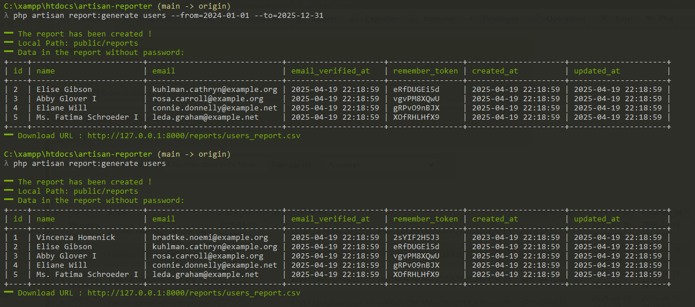

# ArtisanWebShell

A web-based Artisan command runner and CSV report generator built with Laravel and xterm.js.


## 🚀 Features

- 🖥 **Interactive Web Console** – Powered by [xterm.js](https://xtermjs.org/), simulating Laravel Artisan CLI in the browser.
- 📦 **CSV Report Generator** – Generate and download reports from any database table, filtered by date.
- 🔐 **Secure Command Execution** – Uses Symfony Process to safely execute commands.
- 🌐 **Arabic-Friendly Interface** – Ideal for developers in Arabic-speaking regions.

## 📸 Preview

 <!-- Add your screenshot here -->

## 🛠 Installation

1. Clone the repository:

```bash
git clone https://github.com/yourusername/ArtisanWebShell.git
cd ArtisanWebShell
```

2. Install PHP & JS dependencies:

```bash
composer install
npm install && npm run build
```

3. Configure your environment:

```bash
cp .env.example .env
php artisan key:generate
```

4. Configure your database in `.env` file:

```env
DB_CONNECTION=mysql
DB_HOST=127.0.0.1
DB_PORT=3306
DB_DATABASE=artisanwebshell
DB_USERNAME=root
DB_PASSWORD=
```

5. Run migrations and seed users:

```bash
php artisan migrate --seed
```

In `DatabaseSeeder.php`, the following line is used to generate fake users:

```php
\App\Models\User::factory(100)->create();
```

6. Run the server:

```bash
php artisan serve
```

7. Visit `http://localhost:8000/terminal`

## ✨ Usage

- Type any safe shell or Artisan command in the web terminal (e.g. `php artisan list`).
- Generate reports using custom Artisan commands like:

```bash
php artisan report:generate users --from=2024-01-01 --to=2024-12-31
```

- The resulting CSV file will be downloadable via browser.

## ⚠️ Security Notes

- This tool is for development/demo purposes.
- Always validate and sanitize commands on production environments.
- Disable dangerous commands or use command whitelisting.

## 📁 Project Structure

```
├── app/Console/Commands
│   └── GenerateReportCommand.php
├── app/Http/Controllers
│   └── TerminalController.php
├── resources/views
│   └── terminal/index.blade.php
├── routes/web.php
└── public/preview.png
```

## 📖 Philosophy

> This project bridges CLI power and web simplicity. ArtisanWebShell empowers Laravel developers to run commands, generate reports, and learn Artisan features from the comfort of a browser tab.

## 📝 License

This project is open-sourced under the [MIT license](LICENSE).

